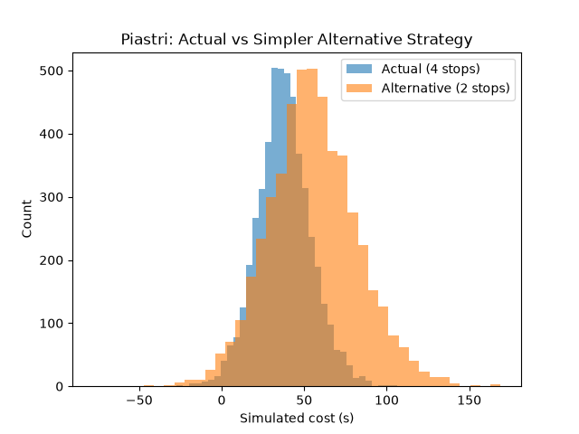
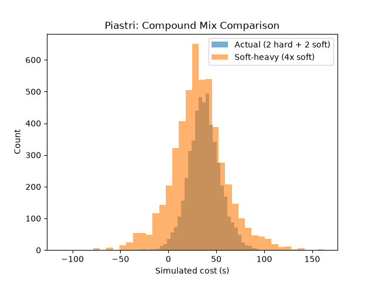

# Was Piastri's 2026 Dutch GP Strategy Actually a Mistake?

**Question:** McLaren's Oscar Piastri ran a widely-criticised 4-stop
strategy at the 2026 Dutch Grand Prix and finished sixth, well behind
race-winning teammate Lando Norris. Was this genuinely a strategic error —
or, given his tyres' actual degradation behaviour that race, was it close
to optimal?

**Answer:** His stop count was very likely correct (a simpler 2-stop
alternative would only have been better in ~4% of simulated outcomes, a
result robust across a wide range of pit-loss assumptions). The more
interesting finding is *why*: Piastri's hard-tyre degradation rate that
race was roughly 55% higher than his own teammate's, in the same car — a
genuine, driver-specific anomaly rather than a car-wide or track-wide tyre
problem. A secondary analysis suggests a further compound-mix adjustment
(running more soft, less hard, across the same 4 stops) may have helped
further, though this result is less statistically decisive.

---

## Method

1. **Tyre degradation** — a hierarchical Bayesian model (PyMC), fit
   separately per compound (hard/soft/medium), using real 2026 Dutch GP
   lap-by-lap data across the full field. Lap time is modelled as a
   per-driver intercept and degradation slope, partially pooled toward a
   population-level average — so drivers with limited data on a compound
   get a sensible, appropriately uncertain estimate rather than an
   overconfident one. A non-centered parameterization was used throughout
   to avoid the divergent-sampling issues common to this model structure.
2. **Safety car risk** — a Bayesian Poisson model fit to real incident
   counts (safety car, virtual safety car, red flag) across the 11 races
   of the 2026 season that preceded the Dutch GP — deliberately excluding
   later races, so the model only reflects information that would
   genuinely have been available at the time of the strategy decision.
3. **Race-specific counterfactual** — rather than simulating safety car
   timing, the actual, known incident laps from the real 2026 Dutch GP
   were used directly, since the race had already happened. This lets the
   analysis credit (or penalise) each candidate strategy fairly, based on
   what genuinely occurred, not a generic probability.
4. **Monte Carlo comparison** — 5,000 simulated outcomes per comparison,
   drawing degradation rates from each model's posterior distribution, to
   compare Piastri's actual strategy against realistic alternatives.

## Data

Real 2026 F1 timing data via [FastF1](https://github.com/theOehrly/Fast-F1):
full-field race data from the Dutch GP (for degradation models) and race
control/track status data from the 11 preceding 2026 races (for the safety
car rate model).

## Results

**Tyre degradation rates (seconds per lap of tyre age):**

| | Population average | Piastri | Norris |
|---|---|---|---|
| Hard | 0.0266 [0.012, 0.043] | **0.0438** [0.012, 0.08] | 0.0286 [0.0007, 0.06] |
| Soft | -0.0053 [-0.038, 0.03] (flat) | -0.005 [-0.068, 0.061] (flat) | — |
| Medium | 0.058 [0.033, 0.085] | — (only 1 lap run) | — |

Piastri's hard-tyre degradation sits meaningfully above both the field
average and his own teammate's, in identical machinery — the central
finding this project is built around.

**Safety car rate (2026 season, pre-Dutch GP):** mean 1.83 incidents/race
[1.3, 2.5], translating to a per-lap incident probability of ~0.025 over a
72-lap race.

**Real Dutch GP incident laps:** 2 (mandatory red flag), 55-57 (safety
car/VSC), 70 (brief VSC).

**Strategy comparison — actual (4 stops) vs a simpler 2-stop alternative:**

| | Actual (4 stops) | Simpler 2-stop |
|---|---|---|
| Mean simulated cost | **37.80s** | 55.31s |
| P(alternative better) | — | 4.26% (3.7–4.5% across pit-loss 15-25s) |

**Compound-mix comparison — actual (2 hard + 2 soft) vs a soft-heavy
alternative (same 4 stops, mostly soft):**

| | Actual | Soft-heavy |
|---|---|---|
| Mean simulated cost | 37.57s | **31.80s** |
| P(soft-heavy better) | 63.92% |

## Verdict

The popular "strange strategy" framing doesn't hold up under analysis.
Given how Piastri's specific tyres were behaving that race, splitting hard
tyre usage across two shorter stints — as he did — was close to optimal,
and a conventional 2-stop would very likely have cost him more time, not
less. The real, more interesting story is upstream of the strategy call
itself: something about that race left Piastri's hard tyres degrading far
faster than his teammate's, and no strategy change fixes a tyre problem —
it can only manage it better or worse. There's a secondary, less certain
signal that leaning further into soft tyres across those same four stops
might have helped further.

## Limitations

- **Causal ambiguity.** The model identifies a real, statistically
  meaningful gap between Piastri's and Norris' hard-tyre degradation, but
  cannot distinguish between explanations (driving style, tyre management,
  track position, fuel load timing, dirty air from following another car).
- **Sparse medium-tyre data for Piastri** — he ran only 1 lap on mediums
  (a forced stop under red flag), so his personal medium degradation is
  effectively unknown; the population estimate was used in its place,
  explicitly flagged wherever it appears.
- **Linear degradation model with no wear ceiling** — candidate strategies
  were deliberately kept within stint lengths the field actually achieved
  that race, to avoid the model extrapolating into physically unrealistic
  tyre life.
- **No credible soft-tyre degradation signal was found** at the population
  level this race, which is somewhat counterintuitive; fuel burn-off and
  limited soft-stint data are plausible partial explanations, discussed
  but not confirmed.
- **Pit-loss time was estimated** (~15-18s, based on Zandvoort's specific
  pit-lane speed limit), not measured directly; the stop-count finding was
  checked for robustness across a 15-25s range and held throughout — the
  compound-mix finding was not re-tested against this same range.

## Repository contents

- `strategy_sim.ipynb` — full notebook: data pipeline, three hierarchical
  degradation models (hard/soft/medium), safety car rate model, and all
  Monte Carlo comparisons
- `strategy_comparison.png` — actual vs simpler-alternative outcome
  distributions
- `compound_mix_comparison.png` — actual vs soft-heavy compound mix
  outcome distributions

## Possible extensions

- Extend the driver-level comparison to the full field, not just
  Piastri vs Norris, to see how unusual his degradation gap really was
- Investigate potential causes of the degradation gap directly (following
  distance/dirty air from telemetry, fuel-corrected lap times)
- Re-run the compound-mix comparison across the same pit-loss sensitivity
  range used for the stop-count finding
